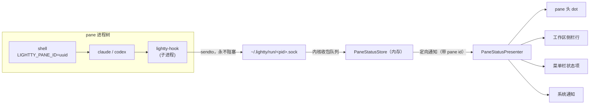

# Pane 状态感知与提醒 —— 实施计划

把 lightty 从「能开多个终端的壳」变成「知道 agent 在干什么的终端」。

agent 的 hook 事件主动打到 lightty，驱动 pane 级实时状态（思考中 / 执行工具 /
需要你 / 已完成），呈现在 pane 头、工作区侧栏、菜单栏状态项，并在 agent 跑完时
主动提醒。

> handoff 注入已随本期一起落地（`SessionStart` 与 `UserPromptSubmit` 读 `task` 指针、经 `additionalContext` 注入，后者按 session+路径去重），见 §8。

---

## 1. 为什么这个功能值得先做

- **不依赖任务绑定**：状态只需要 `LIGHTTY_PANE_ID`，pane 有没有绑 task 都能用。
  即使用户从不用 handoff，装了 hook 也白拿「agent 状态可视化 + 完成提醒」。
- **多 pane 并行是 lightty 的主场景**：开 5 个 agent 跑，哪个完事了立刻知道是哪个。
  Ghostty/iTerm 做不到——它们不知道 agent 的生命周期。
- **它是 handoff 注入的地基**：链路（env var → pointer → hook）先在低风险功能上跑通。

### 与已废弃的 `status` 字段的关系

`docs/task-format.md` 里 frontmatter 的 `status` 已于 2026-08-30 弃用，理由是
「天然滞后、易撒谎、先造字段再找用途」。**本期的状态与它无关，不要复活那个字段。**
`TaskStatus`（`LighttyCore/TaskFile.swift`）也不是本期状态的容身处。

区别是本质性的：那个 status 是 agent 临别时手写的一次性判断；本期状态是机器
从生命周期事件派生的实时信号——不滞后、不可能撒谎、用途先于字段存在。

---

## 2. 已验证的事实（不要重新推导）

### 2.1 内核与 hook 链路（本轮实测）

| 事实 | 状态 |
|---|---|
| `ghostty_surface_config_s` 有 `env_vars` / `env_var_count` | ✅ `vendor/ghostty/include/ghostty.h` 与实际链接的 xcframework 头一致 |
| ghostty 把 env 值 `dupeZ` 进自己的 arena | ✅ `vendor/ghostty/src/apprt/embedded.zig`——**C 字符串只需活过 `ghostty_surface_new`，之后可释放** |
| 不需要改 ghostty 内核 | ✅ 上游已支持 |
| **注入的 env 能穿过 `/usr/bin/login` 到达 shell** | ✅ **运行时实测**：`ghostty_surface_config_s.env_vars` → 真实 zsh 进程里 `LIGHTTY_PANE_ID` 有值。ghostty 用 `login -flp`（`-p` = preserve environment），`vendor/ghostty/src/termio/Exec.zig`。<br>⚠️ **不要用 `ps eww` 验证**：macOS 不让读经 setuid `login` 派生的进程环境，会假报「变量不存在」。要验证就让 shell 自己把 env 写到文件 |
| hook 事件 key 是 **PascalCase** `SessionStart` | ✅ snake_case / camelCase 均不触发 |
| 两家 hook 的 output wire **完全相同** | ✅ `{"hookSpecificOutput":{"hookEventName":…,"additionalContext":…}}` |
| 环境变量沿 shell → agent → hook 子进程继承 | ✅ |
| Claude Code `--settings` 接受**内联 JSON** | ✅ |
| Codex hooks 有 **trust 机制**，首次需用户批准 | ✅ `--dangerously-bypass-hook-trust` 会打 warning，不适合日常 |
| `$LIGHTTY_*` 未设时 hook 静默 exit 0，无噪音 | ✅ |
| Codex 改 hook **脚本内容**是否重新触发 trust | ⚠️ 待实测 |
| Claude Code 是否有 `Notification` 事件 | ⚠️ 待实测（Codex 侧 `PermissionRequest` 已确认） |

### 2.1.1 注册方式：插件路线（2026-09-02 实测改用）

早先的做法是把 7 条 hook 直接 merge 进用户的 `~/.claude/settings.json` /
`~/.codex/hooks.json`。已废弃，改走两家自己的插件系统。以下全部实测确认：

| 事实 | 状态 |
|---|---|
| 两家都支持**插件自带 hooks** | ✅ Claude Code `hooks/hooks.json`；Codex 清单里 `"hooks": "./hooks.json"` |
| **一个 marketplace 目录同时服务两家** | ✅ 元数据位置不冲突（`.claude-plugin/` vs `.agents/plugins/`），同一目录 `claude plugin validate` 零警告通过，`codex plugin marketplace add` 也接受 |
| 两家都有官方 CLI 可完成注册 | ✅ `claude plugin marketplace add/install/uninstall`；`codex plugin marketplace add` + `codex plugin add/remove` |
| Codex 的 `plugin add` **必须**用 `plugin@marketplace` 形式 | ✅ 否则报 "requires --marketplace" |
| 插件带的 hook 在 Claude Code 里**立即生效，无信任门** | ✅ 隔离配置里实测触发（即使该环境未登录、模型调用失败，`UserPromptSubmit` 仍写出了状态） |
| 插件带的 hook 在 Codex 里**仍受信任门约束** | ✅ 不批准不执行；加 `--dangerously-bypass-hook-trust` 才跑。**信任是按 hook 本身管的，不看来源**——`hooks/list` 的响应结构里 `trustStatus`/`currentHash` 与 `marketplaceName`/`marketplacePath` 同属一个结构体 |
| 装完后用户配置里**没有任何 hook 定义** | ✅ Claude Code 只多 `extraKnownMarketplaces` + `enabledPlugins` 两个键；Codex 的 `hooks.json` 根本不被创建，`config.toml` 只多 5 行 |
| Codex 安装时**拷贝**插件进自己的 cache | ✅ 落在 `plugins/cache/<mp>/<plugin>/<version>`——改 marketplace 不会自动更新已装插件，需要 update 路径 |
| `hooks.managed_dir` 能否用来免配置 | ❌ **不可用**：它属于企业 MDM 策略面（与 `allow_managed_hooks_only`、`allowed_login_methods` 同结构），第三方 app 占用管理员控制面是越界 |
| 通配事件 key（`"*"` / 事件数组） | ❌ 两家都不支持，每个事件必须独立成键；`matcher` 只在单个事件内过滤 |

**为什么这条路更好**：7 条 hook 定义搬进**我们自己的文件**，用户配置里只留声明式开关；
而且注册由**它们自己的 CLI** 完成，我们不再需要理解、维护、也不可能写坏它们的配置格式。
全项目风险最高的那段 merge/backup/purge 机器随之退役。

**Codex 的信任提示不会消失，这是对的**：用户装插件本来就该批准一次，属于用户与 Codex
之间的正常交互，不是我们要绕开的东西。

### 2.1.2 传输层：datagram socket（2026-09-01 实测改用）

早先状态走 `status.json`（hook 覆写 + `TaskFolderWatcher` 目录监听）。已废弃，改为
**Unix domain `SOCK_DGRAM` socket**，hook 发包、app 收包、状态只在内存。以下全部实测：

| 事实 | 数据 |
|---|---|
| 状态是**用完即弃**的中间态 | 用户定义。app 没运行时消息直接丢弃，无需补账——这条前提推翻了「持久化路径必须存在」的文件论据 |
| 尾沿防抖会**饿死** | 一轮真实对话 19 事件，app 只看到 **1 个**；事件间隔 150ms 时 20 个只看到 1 个。`PreToolUse/PostToolUse` 夹 200ms 内的工具调用正好落进这个坑，`tool` 状态从未显示过 |
| 文件是**可变槽位**，不是队列 | 主线程 83% 繁忙时 200 事件只收到 **47**；socket 与追加日志均 200/200。槽位退化的是正确性且静默，队列退化的只是延迟 |
| hook 进程成本与传输无关 | 全生命周期 ~4.2ms，其中构造 JSON 占 1.6–1.9ms（dyld 加载 Foundation），发送仅 13µs（dgram）～253µs（文件）。**选型不该看建连接开销** |
| dgram 的失败行为 | 无监听者 `ENOENT` 13µs；崩溃残留 `ECONNREFUSED` 22µs；接收方卡死 `ENOBUFS` 4µs——**永不阻塞**，即使是阻塞 socket。这是「hook 绝不能卡住 agent」这条硬约束的兑现 |
| 生产端吞吐 | 20 pane 并发 400 次 hook：1097 次/秒，0.9ms/次含 spawn，零丢失 |
| 消费端吞吐（app 空闲） | 单 pane 灌 200 事件：200/200 |
| `sun_path` 上限 | 104 字节；`~/.lightty/run/<pid>.sock` 约 40 字节 |
| 签名 + hardened runtime + 零 entitlement | UDS bind/send 正常，无 TCC 弹窗 |

**被淘汰的方案与硬理由**：

- **XPC**：Apple 头文件明写不可动态向 bootstrap 命名空间加服务；注册需独立 launchd helper 进程
- **`NSDistributedNotificationCenter`**：系统级广播——登录会话内任何进程可读 `cwd`、工具 `detail`（agent 执行的命令行）、`session_id`，且可伪造。隐私问题，非性能问题
- **`CFMessagePort`**：队列深度实测仅 2，满后每次发送付超时
- **FIFO**：`open(O_WRONLY)` 不带 `O_NONBLOCK` **永久挂住**
- **追加日志**：在压力下与 socket 等价，但「用完即弃」前提下持久化无意义；socket 少一条兜底路径

**多实例**：socket 按 lightty **pid** 命名，路径随 spawn 以 `LIGHTTY_SOCK` 下发给每个 pane 的
shell。各实例各绑各的，无 EADDRINUSE 探测、无 unlink 孤儿化。崩溃残留按 pid 判活清理。

**`seq` 删除**：它对文件做读-改-写，agent 并行调工具时竞争；datagram 到达顺序就是顺序。

**保留文件的部分**：`task` 指针（lightty 写、hook 读、持久语义）与 `owner.pid`。方向与生命周期
都和状态不同，不混。

### 2.2 代码库现状（本轮调研）

| 事实 | 影响 |
|---|---|
| **`LighttyCore/TaskFolderWatcher.swift` 已存在、通用、有测试、但从未接壳** | 不要重写 FSEvents。它是 `DispatchSource` + `O_EVTONLY`，`directory` 是构造参数，直接可用 |
| 该 watcher **只监听目录级事件**，文件原地修改不触发 | 写方必须原子写（tmp + `rename(2)`）。与 `TaskStore.atomicWrite` 同约定 |
| 该 watcher 回调在**私有队列**，不是主线程 | 所有 UI 消费者必须 `DispatchQueue.main.async` |
| 该 watcher `init` 在目录不存在时 **throw** | 先建目录再建 watcher |
| 代码库**零 JSON**（无 `Codable`/`JSONDecoder` 使用） | `PaneStatus: Codable` 是新领域，但 `LighttyCore` 是正确归属（Foundation-only，测试 target 已接好） |
| `PaneHeaderView` 已有 `beginCapsuleAttention()` / `endCapsuleAttention()` | 呼吸环动画（`CABasicAnimation`，0.9s autoreverse）**直接复用给 `attention` 态** |
| hover ✕ 与 dot **同插槽互斥**：`dotView.isHidden = capsuleHovered` | hover 时状态指示会整个消失，S4 必须处理 |
| `dotView` **在水平约束链上**（`nameLabel.leading == dotView.trailing + 6`） | **绝不可加宽 dot**——会推移 pane 名，破坏与 `PaneIdentityPanel` 首行的逐像素对齐契约 |
| dot 配色在 **5 处重复**：`PaneHeaderView` / `WorkspaceColumnView` / `TaskSidebar` / `SearchPalette` / `PaneIdentityPanel` | S4 顺手收敛成 `ShellStyle` 语义 token |
| `WorkspaceColumnView.reload()` **拆掉重建每一行** | 高频状态更新不能走它，需要行内原地更新 |
| `PaneRowView` **不持有 pane 引用** | 要原地更新必须先加 |
| 全库**没有 `requestAuthorization`**，也没有 `UNUserNotificationCenterDelegate` | 通知从未申请过权限；前台时通知不显示。S5 必须补 |
| `GhosttyRuntime` 已有通知发送路径（响铃 → `dockTile.badgeLabel = "!"`，从不清除） | 相关先例，S5 注意别打架 |
| `applicationShouldTerminateAfterLastWindowClosed → true` | 与「菜单栏常驻」冲突，S5 需处理 |
| `ShellMenuPopover` 锚定 `NSView` | 状态项菜单用不了它，用原生 `NSMenu` |
| `L()` 在 `LighttyCore` 里**不可用** | `PaneStatus` 不做本地化 |

### 2.3 历史核查结论（已完成）

**`HANDOVER.md:156` 记录：2026-08-22 用户否决过 hooks 方案。** 三条理由与本期的对应关系：

| 当年的否决理由 | 本期是否仍然成立 |
|---|---|
| handoff 生成耗 token | ❌ 不成立。当年 hook 内要调 `claude -p` 读 transcript 生成摘要；本期 hook 只写一个几百字节的 JSON、只读一个已存在的文件，**零模型调用** |
| hook 时机会重复触发 | ❌ 不成立。当年重复触发会重复**生成并写入** handoff（有损、有成本）；本期状态是 datagram 推送、用完即弃，重复到达只是多刷一次同值；handoff 注入是 `SessionStart` 只读，重复触发无害 |
| 写全局 settings.json 不干净 | ✅ **已消解**（2026-09-02）。改走插件路线后，7 条 hook 定义在我们自己的文件里，用户配置只多几行声明式开关，而且是**它们自己的 CLI** 写的，不是我们。见 §2.1.1 |

结论：三条否决理由**全部消解**。

**`main.swift` 的环境净化不冲突**：它 unset 的是 lightty **自身进程**从父终端继承来的
`CLAUDE_CODE_*`（防止 pane 被 Claude Code 当成嵌套子会话）。本期走
`ghostty_surface_config_s.env_vars` **逐 surface** 注入，不碰进程全局环境——而且每个
pane 需要不同的值，进程级变量本来也做不到。两者正交。

**旧手动 `HandoffPrompt` 实现里「LIGHTTY_TASK 已整体移除」的记录**指的是任务路径
当时改为点击时实时嵌入提示词，不是说 env var 机制有问题。本期的 `LIGHTTY_PANE_ID` 用途不同
（pane 身份，不是任务路径），不受该结论约束。

---

## 3. 架构总览



单向数据流：hook 只发，lightty 只收。状态只在内存，用完即弃。没有 daemon，没有状态文件。

---

## 4. 契约（**先冻结，这是并行的前提**）

所有 stream 依赖本节。开工前定稿；开工后改动需同步所有 stream。

### 4.1 目录布局

```
~/.lightty/
  tasks/                      ← 已存在，本期不动
  bin/
    lightty-hook              ← symlink，指向当前 app bundle 内的 helper
  run/
    <lightty-pid>.sock        ← 每实例一个 datagram socket，hook 发、app 收
  panes/
    <pane-uuid>/
      owner.pid               ← lightty 进程 pid，用于 GC
      task                    ← lightty 写，hook 读（handoff 注入，一行绝对路径）
```

**状态不落文件**——它是用完即弃的中间态，走 socket 直达内存（§2.1.2）。

**一个 pane 一个目录**，因为每个目录挂**一个 `TaskFolderWatcher`**——闭包捕获
paneID，天然知道是哪个 pane 变了，不需要重扫。fd 开销可忽略（pane 数量是个位数）。

**为什么要 `bin/lightty-hook` 这层 symlink**：hook 注册进 agent 配置时写的是绝对
路径。用户把 app 从下载目录拖进 `/Applications` 后路径就断了。lightty 每次启动
刷新这个 symlink 指向 `Bundle.main` 内的真实 helper，注册的路径永远稳定。

### 4.2 线格式：一事件一 datagram

```json
{
  "v": 1,
  "pane": "8ADA89EE-835E-4DDD-8E93-FD684BF4EBFB",
  "ts": "2026-09-01T04:12:00Z",
  "state": "tool",
  "agent": "claude",
  "session_id": "01a05cb9-c096-7ac2-b84a-ccfaf62ed450",
  "tool": "Edit",
  "detail": "Sources/lightty/PaneView.swift",
  "cwd": "/Users/florian/project/ai/lightty"
}
```

| 字段 | 必填 | 说明 |
|---|---|---|
| `v` | 是 | schema 版本，当前恒为 `1`。读方遇到未知版本忽略整个文件，不报错 |
| `pane` | 是 | 路由字段（信封），app 据此定向投递。一个 socket 服务全部 pane |
| `ts` | 是 | ISO8601 UTC |
| `state` | 是 | 见 §4.3 |
| `agent` | 否 | `claude` \| `codex` \| 其他 |
| `session_id` | 否 | agent 会话 id |
| `tool` | 否 | `state == "tool"` 时的工具名 |
| `detail` | 否 | 单行摘要（如文件路径）。**读方必须截断**，不可信任长度 |
| `cwd` | 否 | agent 工作目录 |

UTF-8，单个 datagram ≤ 4KB。datagram 天然保留消息边界，不需要分帧。
**没有 `seq`**：UDS 上的到达顺序就是顺序。

### 4.3 状态机

| state | 语义 | 触发事件（Claude Code / Codex） |
|---|---|---|
| `idle` | 无活跃 turn | `SessionStart`、`SessionEnd` |
| `thinking` | turn 进行中 | `UserPromptSubmit`、`PostToolUse` |
| `tool` | 正在执行工具 | `PreToolUse` |
| `attention` | 需要用户介入 | `Notification` / `PermissionRequest` |
| `done` | turn 完成，**未读** | `Stop` |

`done` 是唯一的「粘滞」状态：只有用户 focus 该 pane（或在菜单栏点「全部已读」）
才转回 `idle`。**清除由 lightty 侧完成，hook 不参与**——hook 不知道用户看没看。

### 4.4 Swift 契约

`Sources/LighttyCore/PaneStatus.swift`（纯逻辑，helper 与主 app 共用）：

```swift
public enum PaneActivity: String, Codable, Sendable {
    case idle, thinking, tool, attention, done
}

public struct PaneStatus: Codable, Sendable, Equatable {
    public let v: Int
    public let seq: UInt64
    public let ts: Date
    public let state: PaneActivity
    public let agent: String?
    public let sessionID: String?
    public let tool: String?
    public let detail: String?
    public let cwd: String?
}
```

`Sources/lightty/PaneStatusStore.swift`：

```swift
final class PaneStatusStore {
    static let shared: PaneStatusStore

    /// 建运行时目录 + owner.pid + 启动该 pane 的 watcher
    func attach(_ paneID: UUID)
    /// 停 watcher + 删目录 + 清状态
    func detach(_ paneID: UUID)

    func status(for paneID: UUID) -> PaneStatus?
    func markRead(_ paneID: UUID)        // done → idle
    func markAllRead()

    var unreadCount: Int { get }
    var aggregate: PaneActivity { get }  // 菜单栏图标用

    /// 启动时清理死进程残留（按 owner.pid 判活）
    func sweepStale()
}

extension Notification.Name {
    static let lighttyPaneStatusDidChange = Notification.Name("lighttyPaneStatusDidChange")
}
```

通知**不带 payload**（与现有 `lighttyTasksDidChange` 风格一致），观察者自行查 store。
**必须是独立通知**，不能复用 `lighttyTasksDidChange`——后者会触发侧栏全量拆建。

---

## 5. 工作流分解

### 5.1 文件所有权表（**硬约束：不要碰不属于你的文件**）

| Stream | 独占已有文件 | 新建文件 |
|---|---|---|
| **S1** env 注入 | `TerminalSurfaceView.swift`、`PaneView.swift`、`TerminalWindowController.swift` | — |
| **S2** hook helper | `Package.swift`、`scripts/package-app.sh` | `Sources/lightty-hook/**` |
| **S3** 状态存储与监听 | — | `LighttyCore/PaneStatus.swift`、`LighttyCore/PaneRuntimeDirectory.swift`、`lightty/PaneStatusStore.swift` |
| **S4** pane 头与侧栏呈现 | `PaneHeaderView.swift`、`WorkspaceColumnView.swift`、`ShellStyle.swift`、`TaskSidebar.swift`、`SearchPalette.swift`、`PaneIdentityPanel.swift` | `lightty/PaneStatusPresenter.swift` |
| **S5** 菜单栏与通知 | — | `lightty/StatusBarController.swift`、`lightty/PaneNotifier.swift` |
| **S6** hook 安装器 | — | `lightty/HookInstaller.swift`、`lightty/HookSetupWindow.swift` |
| **S7** 文档 | `docs/task-format.md`、本文件 | `docs/hooks.md` |
| **INT** 集成（串行收尾） | `AppDelegate.swift`、`AppState.swift`、`Resources/*.lproj/Localizable.strings` | — |

**`AppDelegate.swift` / `AppState.swift` / `.strings` 由集成步骤独占**，任何并行
stream 都不许改。每个 stream 提供自包含入口（构造函数 + `install()`）和最多 5 行
接线说明，集成步骤统一接。

**S4 不碰 `PaneView.swift`**：状态推送走 `PaneStatusPresenter` 遍历
`AppState.shared.runningPanes()` 调 `pane.header.apply(status:)`，不需要每个 pane
自己订阅。这样 S1 独占 `PaneView.swift`，冲突归零。

**S1 不碰运行时目录**：`attach`/`detach` 由 S3 实现，S1 只在 pane 生灭处调用。

### 5.2 并行拓扑

```
契约冻结（§4）
      │
      ├─── S1 ──┐
      ├─── S2 ──┤
      ├─── S3 ──┼─── INT 集成 ─── 验收
      ├─── S6 ──┤
      ├─── S7 ──┤
      │         │
      └─ S3 契约 ─┬─ S4 ──┘
                  └─ S5 ──┘
```

S4/S5 只依赖 §4.4 的 **API 签名**，不依赖 S3 的实现——签名已冻结，五路可同时开工。
建议给会改文件的 agent 用 worktree 隔离。

---

## 6. 各 Stream 详细任务

> **传输层已于 2026-09-01 改为 socket（§2.1.2）**。下文 S2/S3 里关于 `status.json`、
> `TaskFolderWatcher`、`seq`、原子写的描述是首轮实现的分工记录，**已被取代**，保留只为
> 说明当时为什么这样分。现行契约以 §4 为准。

### S1 — env 注入

**目标**：每个 pane 的 shell 拿到 `LIGHTTY_PANE_ID`。

0. **先读 §2.3**：`main.swift` 的 env 剥离逻辑 + 已退役手动 HandoffPrompt 关于
   `LIGHTTY_TASK` 被移除的历史。搞清原因再动手。
1. `TerminalSurfaceConfiguration` 加 `var envVars: [String: String] = [:]`。
2. `withCValue` 里构造 `ghostty_env_var_s` 数组。
   **关键**：ghostty 会 `dupeZ` 到自己的 arena，C 字符串只需活过 `body(&config)`
   这一次调用。用 `strdup` 建数组、调用后逐个 `free` 即可。现有代码用嵌套
   `withCString` 处理 `workingDirectory`，多个键值对不适合继续嵌套。
3. pane 创建路径（`PaneView.init` / `TerminalWindowController.split` /
   `addPaneToActiveTab`）注入 `LIGHTTY_PANE_ID = pane.dragIdentifier.uuidString`，
   并调 `PaneStatusStore.shared.attach(pane.dragIdentifier)`。
4. pane 关闭路径调 `PaneStatusStore.shared.detach(...)`。

**注意**：`dragIdentifier` 是 `let dragIdentifier = UUID()`，每次启动重新生成，
全库无状态恢复机制。状态是易失的，这没问题——但正因如此 S3 必须有 `sweepStale()`。

**验收**：新开 pane，`echo $LIGHTTY_PANE_ID` 有值；split 出来的 pane 有**不同**的值；
Address Sanitizer 下反复开关 pane 无内存错误。

---

### S2 — `lightty-hook` helper

**目标**：一个启动极快、零依赖的可执行文件，把 hook 事件翻译成 `status.json`。

1. `Package.swift` 加 `.executableTarget(name: "lightty-hook", dependencies: ["LighttyCore"])`。
   **只依赖 Foundation + LighttyCore，绝不链 AppKit / GhosttyKit**——`PreToolUse`
   触发频繁，启动开销直接变成每次工具调用的延迟税。
2. 从 stdin 读 JSON，取 `hook_event_name`，按 §4.3 映射成 `state`。
   两家输入 schema 几乎一致（`session_id` / `cwd` / `hook_event_name` /
   `tool_name` / `tool_input`），一份解析代码通吃。
3. `LIGHTTY_PANE_ID` 未设 → **exit 0，不输出任何东西**。
4. 原子写 `status.json`；`seq` 从已有文件读出后 +1。
5. stdout 输出 `{"continue":true}`——本期不注入 context，第二期再加
   `hookSpecificOutput.additionalContext`。
6. `scripts/package-app.sh`：helper 拷进 `Contents/MacOS/lightty-hook`，
   加进签名流程和资源契约自检清单（脚本已有自检机制，照现有格式补一条）。

**验收**：
```sh
echo '{"hook_event_name":"PreToolUse","tool_name":"Edit"}' \
  | LIGHTTY_PANE_ID=test ./lightty-hook
cat ~/.lightty/panes/test/status.json   # state == "tool"
```
以及未设 `LIGHTTY_PANE_ID` 时无输出、无副作用、exit 0；连续调用 `seq` 递增。

---

### S3 — 状态存储与监听

**目标**：`status.json` 的变化在 ~250ms 内变成一次主线程通知。

1. `PaneRuntimeDirectory`（LighttyCore）：建/删目录、写 `owner.pid`、
   `sweepStale()` 遍历 `panes/` 把 `owner.pid` 已死的整个删掉
   （用 `kill(pid, 0)` 判活，兼容多实例 lightty）。
2. `PaneStatus` 的 `Codable` 实现 + 解析容错（未知 `v` 忽略、字段缺失不崩）。
   **这是全库第一处 JSON**，配套单元测试（`LighttyCoreTests` 已接好）。
3. `PaneStatusStore.attach(_:)`：建目录 → 建 `TaskFolderWatcher(directory:)`
   （**复用现成类，不要重写**）→ 闭包捕获 paneID。
   - watcher 回调在私有队列，**必须 `DispatchQueue.main.async` 回主线程**
   - watcher `init` 会 throw（目录不存在），先建目录
   - debounce 用它自带的参数（默认 0.2s）
4. 读文件 → 按 `seq` 丢弃乱序 → 更新 store → post `lighttyPaneStatusDidChange`。
5. `markRead` / `markAllRead` / `aggregate` / `unreadCount` / `detach` 按 §4.4 实现。

**验收**：手工原子写一个 status.json，通知在 250ms 内到达**主线程**；
乱序 `seq` 被丢弃；一秒内写 50 次，通知次数远小于 50；
`kill -9` lightty 后重启，残留目录被 `sweepStale()` 清掉。

---

### S4 — pane 头与侧栏呈现

**目标**：状态可见，且不打扰。

1. `ShellStyle` 加状态色 token（沿用 `shellDynamic(light:dark:)` 风格，明暗两套）：
   `statusIdle` / `statusThinking` / `statusTool` / `statusAttention` / `statusDone`。
   **顺手收敛 5 处重复的 dot 配色**（`PaneHeaderView.Dot` / `WorkspaceColumnView`
   内联 / `TaskSidebar.dotColor(for:)` / `SearchPalette` / `PaneIdentityPanel`）。
2. `PaneHeaderView.apply(_ status: PaneStatus?)`：
   - **绝不加宽 `dotView`**——它在水平约束链上（`nameLabel.leading == dotView.trailing + 6`），
     加宽会推移 pane 名，破坏与 `PaneIdentityPanel` 首行的逐像素对齐契约
   - `thinking` / `tool` 给 dot 一个**低调**的呼吸（改颜色/透明度，不改尺寸）
   - `attention` **直接复用现成的 `beginCapsuleAttention()` / `endCapsuleAttention()`**
   - **必须处理 hover ✕ 冲突**：`capsuleHovered` 时 `dotView.isHidden = true`，
     状态指示会整个消失。建议 hover 时让 ✕ 的 tint 反映状态，
     或对 `attention`/`done` 抑制替换
   - dot 颜色会经 `PaneView.refresh(panel:)` 传给 `PaneIdentityPanel`，
     但只在 bind/unbind/rename 时刷新——状态变化要同步刷新灵动岛
3. `WorkspaceColumnView`：`PaneRowView` 的 dot 插槽**无竞争**（✕ 在行尾），
   是最容易落状态的地方。
   - `PaneRowView` 目前**不持有 pane 引用**，先加，才能原地更新
   - **不要走 `reload()`**——它拆掉重建每一行，高频状态更新会闪
   - 加 `updateStatus(_:)` 做行内更新；`done` 的行给轻高亮
4. `PaneStatusPresenter`：观察 `lighttyPaneStatusDidChange`，遍历
   `AppState.shared.runningPanes()` 分发到各 pane 的 header 与侧栏行。
   提供 `install()` 供集成步骤调用。

**动效要求**：本仓库已装 `review-animations` / `improve-animations` skill，
动效实现前先过一遍。呼吸动画用 Core Animation（参照现成的
`beginCapsuleAttention`），不要用 Timer 驱动。
**动画必须在 pane 不可见 / 窗口非活跃时暂停**，不能让后台 pane 空转烧电。

**验收**：手写 status.json 能驱动 dot 变色；hover ✕ 时无视觉冲突；
侧栏行原地更新不闪；后台 pane 动画停止；明暗主题切换颜色正确
（注意 `layer.backgroundColor` 必须走 `shellResolvedCGColor(for:)`）。

---

### S5 — 菜单栏状态项与系统通知

**目标**：lightty 不在前台时，用户也知道 agent 跑完了。

1. `StatusBarController`：
   - `NSStatusItem`（全库首次使用，无既有代码可参考）
   - 图标反映 `aggregate`：全空闲 = 低调轮廓；有 `thinking`/`tool` = 活动态；
     有 `done`/`attention` = 带 badge
   - 菜单列出所有 pane（跨窗口，走 `AppState.runningPanes()`），
     状态字形 + pane 名 + 任务名
   - 点某项 → 激活窗口并 focus 该 pane → 顺带 `markRead`
   - 「全部标记已读」项
   - 提供开关：用户可以完全关掉菜单栏项
   - **注意 `applicationShouldTerminateAfterLastWindowClosed` 目前是 `true`**，
     与「菜单栏常驻」语义冲突。本期建议**不做常驻**（关完窗口就退出），
     菜单栏项只在有窗口时存在——真要常驻需单独讨论
   - 菜单用原生 `NSMenu`（`ShellMenuPopover` 锚定 `NSView`，用不了）
2. `PaneNotifier`（`UNUserNotificationCenter`）：
   - **全库从未调用过 `requestAuthorization`**，必须补；
     **在第一次真正要发通知时才请求**，不在启动时弹
   - 需要 `UNUserNotificationCenterDelegate`，否则前台时通知不显示
   - 只在「lightty 不在前台」**或**「该 pane 不可见」时发
   - category 带「打开」动作 → focus 对应 pane
   - 多个 pane 同时完成要合并，不能刷屏
   - **注意既有先例**：`GhosttyRuntime` 响铃会设 `window.dockTile.badgeLabel = "!"`
     且从不清除。别和它抢 dock tile，或者顺手修掉那个泄漏
3. 两者都提供 `install()`，不碰 `AppDelegate.swift`。

**验收**：切到别的 app，某 pane 的 agent 跑完 → 收到通知；点通知回到该 pane；
lightty 在前台且该 pane 可见时**不**发通知；拒绝通知权限后功能降级但不崩。

---

### S6 — hook 安装器

**目标**：一次性把 hook 注册进用户已装的 agent，且**绝不破坏用户已有配置**。

1. 探测 `claude` / `codex` 是否存在（`which` + 各自配置目录）。
2. 维护 `~/.lightty/bin/lightty-hook` symlink → `Bundle.main` 内的 helper，
   **每次启动刷新**（app 被移动后路径仍有效）。
3. Claude Code：合并进 `~/.claude/settings.json` 的 `hooks` 键。
   - **读 → 解析 → 合并 → 原子写，并先备份**
   - 我们的条目用 command 路径特征识别，便于幂等与卸载
   - 已存在同路径条目则 no-op
4. Codex：同样合并进 `~/.codex/hooks.json`，事件 key 用 **PascalCase**。
5. 卸载：只移除我们自己的条目，不动别人的。
6. UI（`HookSetupWindow`）：说明装了什么、装到哪、能关掉；
   **必须解释 Codex 的 trust 提示**——用户下次跑 codex 会看到审核提示，
   事先说明白，否则会被当成可疑行为。

**风险最高的一条**：用户的 `~/.claude/settings.json` 可能已有 hooks、
可能格式不标准。写之前必须备份，解析失败就放弃并提示手动配置，**绝不覆盖**。

**验收**：在有既存 hooks 的 settings.json 上安装 → 原有条目完好、我们的条目就位；
重复安装幂等；卸载后回到只剩用户自己的条目；解析失败时不写入任何东西。

---

### S7 — 文档

1. `docs/hooks.md`：hook 契约、安装/卸载、故障排查、隐私说明
   （**状态文件只在本机，不上传任何地方**——这点要写明）。
2. `docs/task-format.md`：在 `status` 弃用一节补交叉引用，
   说明「实时状态」由本机制提供，与该字段无关，避免后人误以为要复活它。
3. 本文件在实现过程中持续修订。

---

## 7. 风险登记

| 风险 | 影响 | 缓解 |
|---|---|---|
| 重蹈 `LIGHTTY_TASK` 被移除的覆辙 | 白做一轮 | S1 开工前先搞清历史原因（§2.3） |
| `withCValue` 里 C 字符串生命周期弄错 | 传给内核野指针，随机崩 | 已确认只需活过 `ghostty_surface_new`；ASan 跑一遍 |
| 破坏用户既有 `~/.claude/settings.json` | 用户现有 hook 全丢，信任崩塌 | 备份 + 合并而非覆盖 + 解析失败即放弃 |
| ~~忘了原子写~~ | ~~watcher 完全不触发~~ | 已随 socket 方案消解（§2.1.2）：不再有文件与 watcher |
| socket 收包回调没回主线程 | UI 从后台线程更新，随机崩 | 契约里写死；store 有 `assert(Thread.isMainThread)` |
| 走 `reload()` 更新侧栏 | 高频拆建，闪烁 + 卡顿 | 契约要求行内更新 |
| 加宽 dot 破坏灵动岛对齐 | 视觉回归，morph 动画错位 | S4 任务里写死「绝不加宽」 |
| Codex trust 提示把用户吓到 | 以为 lightty 在装奇怪东西 | 安装 UI 事先说明；文档写清楚 |
| 呼吸动画在多 pane 下烧电 | 续航变差 | 不可见 pane 暂停；用 Core Animation |
| helper 启动开销 | 每次工具调用都有延迟 | 独立 target，只链 Foundation |
| app 被移动导致 hook 路径失效 | hook 静默失效 | `~/.lightty/bin` symlink 每次启动刷新 |

---

## 8. handoff 注入（已落地）

复用同一条链路做 handoff 注入：

- lightty bind / 新建 / 改名任务时写 `~/.lightty/panes/<uuid>/task`（一行绝对路径），
  解绑时删
- helper 在 `SessionStart` 读它，把 handoff 正文塞进
  `hookSpecificOutput.additionalContext`——agent 开场就知道任务上下文，
  **不需要任何指令遵循**
- helper 在 `UserPromptSubmit` 也读它：先开 agent 再绑任务是常态，不能只靠开场那一发。
  去重标记 `handoff.injected` 记 `<session_id>\n<path>`，任一变了才重注
  （改名换路径 → 重注，agent 需要新的回写地址；同会话重复提问 → 不重注）。
  两家的 `UserPromptSubmit` 都接受 `additionalContext`，wire 与 `SessionStart` 完全一致
- 解绑时 lightty 连去重标记一起删：否则同会话解绑再绑回同一任务会被当成已注过

pane header 的 `Restore` / `Handoff` 手动注入按钮由此退役；恢复后的 agent 启动或
下一次提交会自动收到 handoff。旧 `RestoreFlow` 恢复气泡同样删除：任务卡片点击
已运行任务直接跳转，点击休眠任务直接在当前工作区打开；全文搜索保留显式目的地选择。

---

## 9. 总验收

1. 全新环境装 lightty → 安装器把 hook 装进 Claude Code 和 Codex
2. 开三个 pane，各跑一个 agent
3. pane 头的 dot 实时反映：思考 → 执行工具 → 完成
4. 侧栏同步（原地更新，不闪）；菜单栏显示聚合态
5. 切到别的 app，某个 agent 跑完 → 收到通知 → 点击回到那个 pane
6. focus 后 `done` 转 `idle`
7. 关掉 pane → 运行时目录消失；`kill -9` 后重启残留被清
8. 卸载 hook → 两家配置回到原状，agent 一切如常
